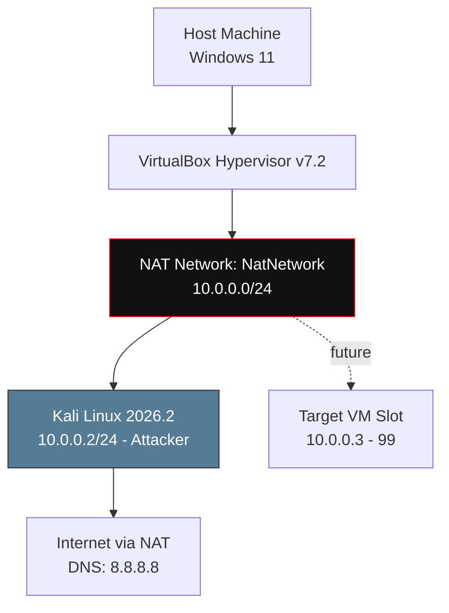
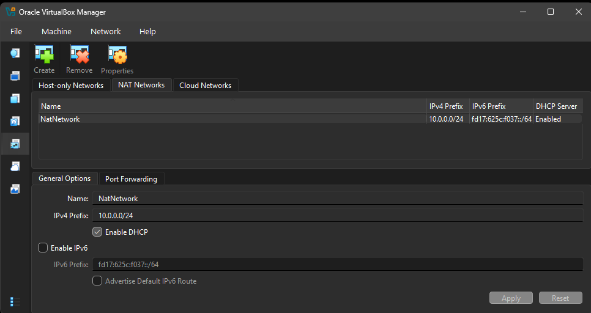
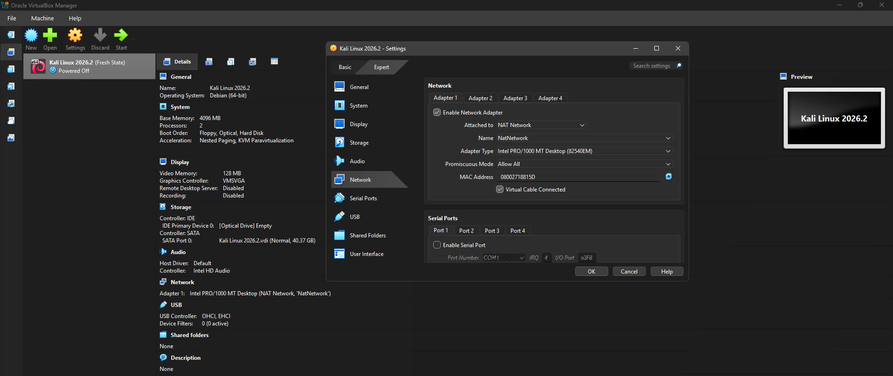
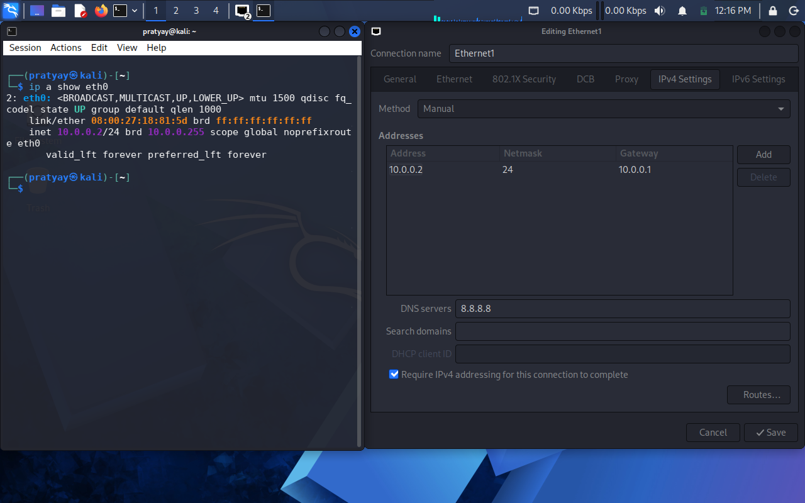
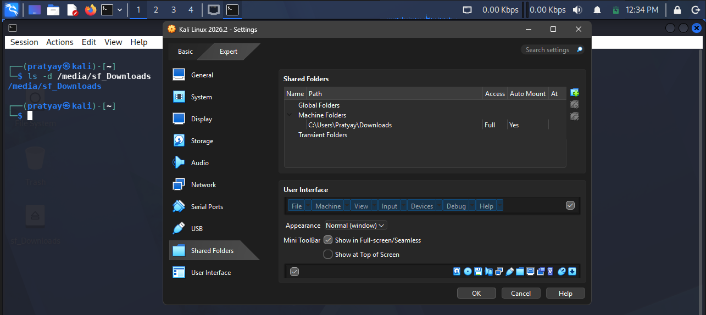
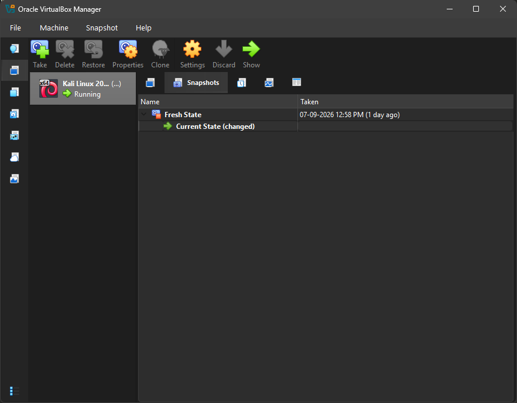
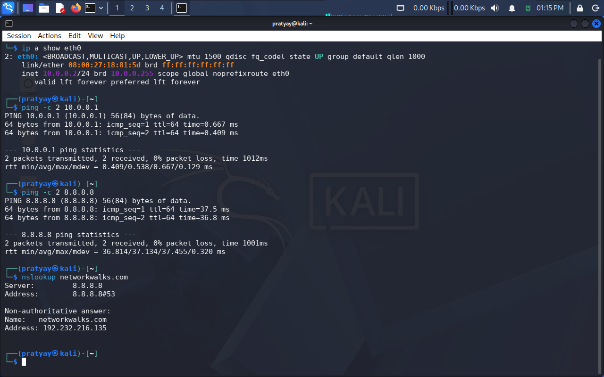

<div align="center">

# Sandboxed Lab Setup

**A Self-Contained Isolated Pentesting Sandbox Built From Scratch On VirtualBox.**


</div>

---

## Table of Contents
- [Engagement Brief](#engagement-brief)
- [Objective & Scope](#objective--scope)
- [Network Architecture](#network-architecture)
- [Lab Specs](#lab-specs)
- [Build Log](#build-log)
- [Verification Tests](#verification-tests)
- [Troubleshooting Journal](#troubleshooting-journal)
- [Key Takeaways](#key-takeaways)
- [Arsenal](#arsenal)
- [Creator](#creator)

---

## Engagement Brief

| Field | Detail |
|---|---|
| Week | 01 |
| Task Code | WK1-PM1 |
| Project | Isolated Cybersecurity Lab Setup |
| Environment | VirtualBox 7.2 + Kali Linux 2026.2 |

---

## Objective & Scope

This isn't just a "VM installed" screenshot dump, it's a documented build of a **sandboxed environment**: a private network where an attacker machine (Kali) can be safely used to practice reconnaissance, scanning and exploitation techniques without ever touching the outside world unintentionally.

The lab was purpose-built to:
- Simulate a real attacker-in-isolation setup
- Stay fully self-contained on a private `10.0.0.0/24` subnet
- Leave room to slot in future target machines without reconfiguration

> **Ethics Notice:** This lab is strictly for authorized, personal and educational use. No tools here were used against systems I don't own or have permission to test.

---

## Network Architecture



Any future VM can be added into the same `10.0.0.0/24` range without touching this base configuration.

---

## Lab Specs

| Layer | Detail |
|---|---|
| Host OS | Windows 11 |
| Hypervisor | VirtualBox 7.2 |
| Guest OS | Kali Linux 2026.2 |
| Allocated RAM | 4096 MB |
| Network Mode | NAT Network (Isolated and Internet-capable) |
| Subnet | `10.0.0.0/24` |
| Kali Static IP | `10.0.0.2/24` |
| Gateway | `10.0.0.1` |
| DNS | `8.8.8.8` |
| Shared Folder | Host `/Downloads` -> Kali |
| Clipboard / Drag-Drop | Bidirectional Enabled |

---

## Build Log

<details>
<summary><b>Step 1 - Hypervisor & Tooling</b></summary>

Installed 7-Zip for archive extraction and VirtualBox 7.2 as the hypervisor.

</details>

<details>
<summary><b>Step 2 - Isolated NAT Network</b></summary>

Created a dedicated NAT Network instead of default NAT — this allows multiple future VMs to talk to each other *and* reach the internet.

```
Name:        NatNetwork
IPv4 Prefix: 10.0.0.0/24
DHCP:        Enabled
IPv6:        Disabled
```



</details>

<details>
<summary><b>Step 3 - Importing Kali Linux</b></summary>

Downloaded Kali Linux 2026.2 (official VirtualBox image) and attached it to `NatNetwork`.




</details>

<details>
<summary><b>Step 4 - Static IP Configuration</b></summary>

```bash
IP Address:  10.0.0.2
Netmask:     255.255.255.0
Gateway:     10.0.0.1
DNS:         8.8.8.8
```



</details>

<details>
<summary><b>Step 5 - Shared Folder & Clipboard</b></summary>

Enabled bidirectional clipboard, drag-and-drop, and mapped host `/Downloads` as a permanent shared folder.



</details>

<details>
<summary><b>Step 6 - Baseline Snapshot</b></summary>

Took a clean snapshot (`Clean-Kali-NetworkSetup`) as a recovery checkpoint before any future exploitation practice.



</details>

---

## Verification Tests

| Test | Command | Result |
|---|---|---|
| Interface & IP | `ip a show eth0` | `10.0.0.2/24` confirmed |
| Gateway reachability | `ping -c 2 10.0.0.1` | Replies received |
| Internet reachability | `ping -c 2 8.8.8.8` | Replies received |
| DNS resolution | `nslookup networkwalks.com` | Resolved |



---

## Troubleshooting

**Issue:** Internet dropped after switching to a static IP (common on Kali 2026.x + VirtualBox 7).

**Root cause:** NetworkManager's DAD (Duplicate Address Detection) timeout stalling the connection.

**Fix:**
```bash
sudo nmcli connection modify "Ethernet1" ipv4.dad-timeout 0
sudo nmcli connection down "Ethernet1"
sudo nmcli connection up "Ethernet1"
```

---

## Key Takeaways

- **NAT vs. NAT Network** - a NAT Network lets multiple VMs cross-communicate *and* reach the internet unlike standard per-VM NAT. Essential for multi-machine labs.
- Static IP + documented subnet ranges make future target VMs trivial to add.
- Snapshots aren't optional - they're the "undo button" for a lab you're about to break on purpose.

---

## Arsenal

| Tool | Purpose |
|---|---|
| [7-Zip](https://www.7-zip.org/) | Archive extraction |
| [VirtualBox 7.2](https://virtualbox.org) | Hypervisor / virtualization layer |
| [Kali Linux 2026.2](https://kali.org/get-kali) | Attacker OS / pentesting distro |
| nmcli | Network interface management |

---

## Creator

Built and documented by **Pratyay Chandra**.

Connect: [LinkedIn](#) • [GitHub](#)

</div>
